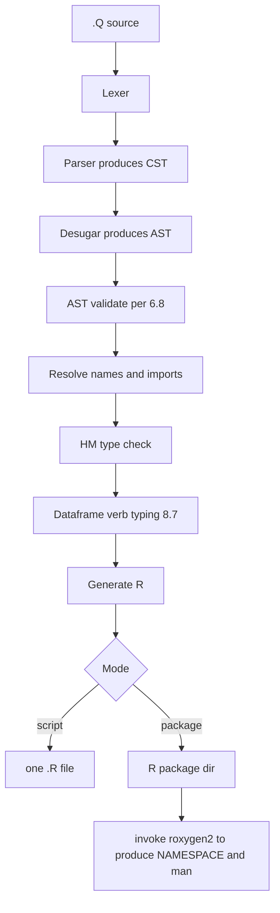

# Quone v0.0.1 - production implementation plan

> Companion to [LANGUAGE.md](LANGUAGE.md). This plan describes how the
> compiler, CLI, test suite, and Elm marketing website will be built to
> implement the v0.0.1 specification.

## Status

| Stage                                   | Status      |
| --------------------------------------- | ----------- |
| Compiler library skeleton               | done        |
| Lexer + tests                           | done        |
| Parser + CST + tests                    | done        |
| Desugaring + AST + validation tests     | done        |
| Name resolution + project model         | done        |
| Type checker (HM core)                  | done        |
| Dataframe verb typing                   | done        |
| R code generator + snapshot tests       | done        |
| Package mode + roxygen2 integration     | done        |
| CLI                                     | done        |
| Property tests + corpus                 | done        |
| Example projects                        | done        |
| Elm marketing website                   | done        |
| Final verification                      | done        |

---

## Repository layout

Three sibling directories under `/Users/armcn/dev/quone-lang/`:

- `compiler/` - the existing Cabal project, restructured. Contains the
  Haskell compiler, CLI, test suite, and the language spec at
  `compiler/docs/LANGUAGE.md`.
- `website/` - new Elm marketing site for `quone-lang.org`.
- `examples/` - sample Quone projects (single-file scripts and
  multi-module packages) used both as documentation and as compiler test
  fixtures.

---

## Compiler (Haskell, nri-prelude, megaparsec)

### Module layout

Restructure the existing scaffold (currently
[compiler/src/Quone/AST/Source.hs](../src/Quone/AST/Source.hs),
[compiler/src/Quone/Generate/R.hs](../src/Quone/Generate/R.hs),
[compiler/app/main.hs](../app/main.hs)) into phase-oriented modules:

```
compiler/
  compiler.cabal             # update: add libraries, deps, test-suite stanzas
  cabal.project
  app/
    quonec.hs                # CLI entrypoint (renamed from main.hs)
  src/
    Quone/
      Position.hs            # SourcePos, SourceSpan
      Diagnostic.hs          # diagnostic categories per LANGUAGE.md section 12.1
      Lex/
        Token.hs             # token type
        Lexer.hs             # megaparsec-based lexer; layout-significant whitespace
      Parse/
        Cst.hs               # raw concrete syntax tree (close to grammar)
        Parser.hs            # megaparsec parser producing Cst
        Desugar.hs           # Cst -> Ast (applies section 5.3 desugarings)
      Ast/
        Source.hs            # AST per LANGUAGE.md section 6 (full, replaces existing)
        Validate.hs          # AST well-formedness rules per section 6.8
      Resolve/
        Names.hs             # cross-module name resolution, import wiring
        Project.hs           # quone.toml parsing, project model
      Type/
        Types.hs             # type representation
        Env.hs               # initial environment (section 8.2 prelude bindings)
        Infer.hs             # HM inference and unification
        Verb.hs              # dataframe verb typing per section 8.7
      Generate/
        R.hs                 # AST -> R Text (replaces existing toy)
        Module.hs            # per-module R file generation
        Package.hs           # full R package directory generation, roxygen2 invocation
        Pretty.hs            # R pretty-printer
      Cli/
        Main.hs              # argument parsing, command dispatch
        Commands.hs          # build, run, fmt, new, repl, version
  examples/                  # symlink to ../examples for fixtures
  tests/
    Spec.hs                  # nri-prelude Test entrypoint
    Lex/        Parse/       Ast/         Resolve/
    Type/       Generate/    EndToEnd/    Property/
    corpus/
      valid/    invalid/     snapshot/
```

### compiler.cabal changes

- Add a `library` stanza exposing `Quone.*` modules.
- Keep the `executable quonec` stanza for the CLI; depend on the library.
- Add a `test-suite quonec-test` stanza using `nri-prelude`'s `Test`
  module.
- New build-deps: `megaparsec`, `parser-combinators`,
  `optparse-applicative` (CLI), `tomland` (`quone.toml`), `text`,
  `containers`, `directory`, `filepath`, `process` (for invoking
  `roxygen2::roxygenise` and `R CMD check`).

### Compiler pipeline



### Coverage of LANGUAGE.md

Each spec section maps to specific compiler modules:

- **Section 3 (lexical)** -> `Lex/Token.hs`, `Lex/Lexer.hs`. Implements
  identifiers, all literals, all keywords (framework / dataframe DSL /
  modifiers), all operators including `//`, `%`, `^`, `<-`, `->`, `|>`,
  `==`, `!=`, `>=`, `<=`, `#`, `#'`. Indentation tracked per section
  3.7. Doc comments captured per section 3.6.
- **Section 4 (modules and imports)** -> `Resolve/Names.hs`,
  `Resolve/Project.hs`. Both `QuoneImport` and `ForeignImport` per
  section 4.5. Visibility check against `exporting (..)`.
- **Section 5 (concrete syntax)** -> `Parse/Parser.hs` produces a CST
  that mirrors the EBNF; `Parse/Desugar.hs` applies the section 5.3
  `if`-to-`case` desugaring. Operator precedence per section 5.2
  including right-associative `^` and tight unary minus. Record
  patterns per section 5.4.
- **Section 6 (abstract syntax)** -> `Ast/Source.hs` defines every
  constructor exactly as in section 6's Haskell signatures.
  `Ast/Validate.hs` enforces all nine well-formedness invariants from
  section 6.8.
- **Section 7 (type system)** -> `Type/Types.hs`. Built-in `Logical` per
  section 7.5.1.
- **Section 8 (static semantics)** -> `Type/Infer.hs` for HM,
  `Type/Verb.hs` for dataframe pipeline typing. Operator typing per
  section 8.8: monomorphic, mixed-primitive operands rejected.
- **Section 9 (dataframe manipulation)** -> handled in `Type/Verb.hs`
  (typing) and `Generate/R.hs` (lowering to `dplyr::verb(...)`).
  Bare-column-name sugar from section 9.2 implemented in
  `Parse/Desugar.hs`.
- **Section 10 (standard environment)** -> `Type/Env.hs` exposes the
  prelude bindings listed in section 8.2.
- **Section 11 (file loading and decoding)** -> CSV decoders implemented
  as prelude functions in `Type/Env.hs`; their lowering rules live in
  `Generate/R.hs`.
- **Section 12 (errors)** -> `Diagnostic.hs` defines all ten error
  categories from section 12.1; every compiler phase produces structured
  diagnostics.
- **Section 13 (translation to R)** -> `Generate/R.hs` and
  `Generate/Pretty.hs`. Full primitive mapping table, operator mapping
  table, curry-to-multi-arg lowering, named/positional argument policy
  from 13.3.1, `purrr` preferences from 13.3.2 with the two base-R
  exceptions, record update via `purrr::list_modify`, foreign-import
  `pkg::fn` qualification.
- **Section 14 (project model)** -> `Resolve/Project.hs` parses
  `quone.toml`. `Generate/Package.hs` produces the package directory per
  section 14.6: kebab-case file names, no function-name mangling,
  package-wide collision check, `roxygen2::roxygenise` invocation for
  `NAMESPACE`/`man`, `Roxygen: list(markdown = TRUE)` in `DESCRIPTION`.

### CLI - `quonec`

Single executable, intuitive subcommands modelled on `cargo` / `elm`:

```
quonec new <name>                  # scaffold a new project (quone.toml + src/Main.Q)
quonec build                       # compile project; auto-detect script vs package mode
quonec build --script foo.Q        # force script mode on a single file
quonec build --package             # force package mode
quonec run [args...]               # build then invoke R on the result
quonec fmt [path]                  # apply formatter (stub for v0.0.1; reports as [planned])
quonec check                       # typecheck without emitting R
quonec repl                        # stub for v0.0.1; reports as [planned]
quonec version                     # print version
quonec --help                      # subcommand help
```

Built with `optparse-applicative`. Every diagnostic is rendered with
source span, category from section 12.1, and a one-line message;
multi-line context with carets when stdout is a TTY.

---

## Test suite (nri-prelude `Test` module)

Section 16 of the spec is treated as a checklist. One test directory per
layer matches section 16.2:

- `tests/Lex/` - lexer tests per section 16.3 (every literal kind,
  every keyword group, every operator, identifier rules, indentation,
  source-position tracking).
- `tests/Parse/` - parser tests per section 16.4 (every grammar
  production, operator precedence including `^` right-assoc and
  `-2 ^ 2 = 4`, `if` desugaring producing `ECase`).
- `tests/Ast/` - well-formedness tests per section 16.5 (all nine
  invariants from 6.8 with positive and negative cases).
- `tests/Type/` - type checker tests per section 16.6 (HM,
  generalisation, every pattern kind, dataframe verb typing, operator
  typing including mixed-primitive rejection).
- `tests/Generate/` - snapshot tests per section 16.7 (every primitive
  mapping, every operator mapping, curry-to-multi-arg, named/positional
  arg policy, purrr preferences and base-R exceptions, record update
  via `list_modify`, dataframe verb lowering, foreign-import `pkg::fn`).
- `tests/EndToEnd/Script.hs` - script-mode E2E per section 16.8
  (compile, invoke R, check stdout/exit code, `Script.expect`
  fail-fast).
- `tests/EndToEnd/Package.hs` - package-mode E2E (compile, invoke
  `roxygen2::roxygenise`, run `R CMD check`, multi-module visibility,
  collision-check rejection).
- `tests/Property/` - property-based tests per section 16.9
  (parser/printer round-trip, type-soundness, operator algebra). Use
  `nri-prelude`'s fuzz module if available; otherwise vendor a minimal
  `QuickCheck`-like layer.
- `tests/corpus/` - versioned test corpus per section 16.10:
  `valid/`, `invalid/` (paired with expected error category and source
  location), `snapshot/`.

Test names follow the `<phase>/<rule>_section_<n_m>` convention from
section 16.14 so failures are traceable to the exact spec rule. Snapshot
updates require an explicit `--accept` flag passed to the test runner.

---

## Examples (`examples/`)

Small but real Quone programs that double as documentation and as test
fixtures (referenced by the corpus tests):

- `examples/hello.Q` - script-mode hello world.
- `examples/scores/` - single-file script computing summary statistics
  from a CSV.
- `examples/stats-package/` - multi-module package with
  `Stats.Transform`, `Stats.Summary`, `Data.Loader`. Demonstrates the
  section 14.6 directory layout, `@export`, and roxygen-driven
  `NAMESPACE`.
- `examples/dataframe-pipeline/` - exercises every normatively-typed
  dataframe verb (`select`, `filter`, `mutate`, `summarize`, `group_by`,
  `arrange`).
- `examples/decoders/` - CSV decoder pipeline using `Csv.column`,
  `Csv.optional_column`.

---

## Website (`website/`, Elm)

Marketing site for `quone-lang.org`. Built with `elm` 0.19,
single-page-app (no routing library beyond `Browser.application`),
styled with `elm-ui` for type-safe layout. Compiled output deployable as
a static site.

### Layout

```
website/
  elm.json
  src/
    Main.elm                 # Browser.application entrypoint
    Page/
      Home.elm               # hero, pitch, code examples
      Install.elm            # install instructions
    Ui/
      Theme.elm              # palette, typography, spacing tokens
      Layout.elm             # header, footer, nav
      CodeBlock.elm          # syntax-highlighted Quone and R blocks
      Button.elm
    Content/
      Examples.elm           # the Quone code samples shown on the home page
      Pitch.elm              # marketing copy
  static/
    index.html               # mounts Main
    favicon.svg
    fonts/
  README.md                  # build and deploy instructions
```

### Visual design - inspired by Elm/Roc/Rescript, with R references

- **Palette** built around R's familiar blue (`#276DC3`, R's logo blue)
  as the primary accent, with a warm dataframe-friendly secondary tone.
  Neutrals are kept high-contrast for readability of code blocks. Light
  theme primary; dark theme as a follow-up.
- **Typography** pairs a humanist sans (Inter) for prose with a
  monospace (JetBrains Mono) for code, matching the readable, editorial
  tone of `elm-lang.org` and `roc-lang.org`.
- **Hero** mirrors `roc-lang.org`'s side-by-side feel: a Quone snippet
  on the left, the generated R on the right, making the language's
  value proposition visible in one glance. Tagline references the R
  lineage explicitly (something like "A typed functional language for
  R").
- **Sections** echo `rescript-lang.org`'s clean section dividers and
  short feature cards: "Hindley-Milner inference", "Native dataframe
  verbs", "Compiles to readable R", "First-class R packages".
- **Code blocks** show the Quone source and the generated R together,
  reinforcing the "boring R" design principle from LANGUAGE.md section
  1.2. Syntax highlighting hand-rolled in Elm (Quone keyword set is
  small enough that this is straightforward).
- **Footer** links to GitHub, the language reference, and
  `r-project.org` to acknowledge the lineage.

### Pages

- **Home** - hero with side-by-side Quone/R, four-card feature grid,
  three or four longer code examples (a script, a dataframe pipeline, a
  CSV decoder, a small package), CTA to the install page.
- **Install** - prerequisites (Cabal, GHC, R, `roxygen2`),
  build-from-source instructions, `quonec new` walkthrough. The
  reference and detailed docs live in `compiler/docs/LANGUAGE.md` and
  are linked rather than re-rendered (per the chosen marketing-only
  scope).

---

## Phasing within the single delivery

Even as one delivery, work proceeds in this order so each layer can be
verified before the next is built on top:

1. Compiler library skeleton + `Diagnostic.hs` + `Position.hs`.
2. Lexer + lexer tests.
3. Parser + CST + parser tests.
4. Desugaring + AST + AST validation tests.
5. Name resolution + project model + resolution tests.
6. Type checker (HM core) + type tests.
7. Dataframe verb typing + verb tests.
8. R code generator + snapshot tests.
9. Package mode + roxygen2 integration + package E2E tests.
10. CLI + CLI tests.
11. Property tests + corpus.
12. Example projects.
13. Website.

Each step finishes with `cabal build` + `cabal test` (or `elm make`)
green before moving on.

---

## Out of scope for this plan

- Items in [LANGUAGE.md section 19](LANGUAGE.md#19-open-questions-and-future-work)
  (block comments, row polymorphism, exhaustiveness checking, additional
  dataframe verb typing, vector patterns, guards, as-patterns,
  `quone.toml` schema beyond the minimum, LSP, REPL, formatter behaviour
  beyond a stub).
- In-browser playground (deferred per the marketing-only website scope).
- Hosting and DNS for `quone-lang.org` (the site is built; deployment is
  left to you).
- Any cross-cutting performance work beyond the section 16.1 "fast at
  the unit layer" target.
</contents>
</invoke>